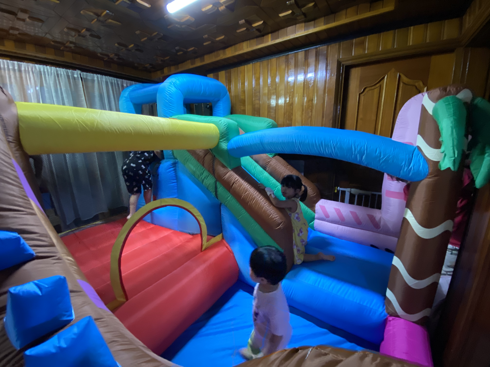

# The plan has been delayed.

In the second half of 2019, i prepared for two possibilities: domestic change jobs and immigration.
However, a sudden attack on COVID-19.
If I decided to emigrate and went to another country, I would be starving or hard life by now. Then, i should have succeeded in changing jobs and worked, but the job market was frozen by COVID-19 attack.
So at the time, I never imagined that I would not be able to find a job at home for 4 to 5 months.

So I wanted to take my children to a quiet place outside Seoul to play(playground. ex: kidscafe?), but it was not easy because of the increase in the number of people infected with the COVID-19.
So at home, children don't get bored and think a lot about making fun everyday.

###### Extreme our job that never ends 24 hours : infant care

Traditionally, South Korea's corporate culture is a form of working in an office. However, the COVID-19 seems to change this form to some extent. Since what I'm thinking for is a form of remote working, the only way to earn money and the same time maintain intimacy with children is to work from home.
(Note: If you have a lot of kids, you need a lot of self-care/control.)

# 1. Possibility? Or should be observe?

Like me, there are many families who married Filipino women and now live in South Korea.
The multicultural families can't all have the same thoughts. But in general, Many families now plan to go to the Philippines, but this is also uncertain, so I'm thinking many families to watch the situation.
(what that means is : The Philippine government's current quarantine policy and take preventive measures.)

However, around the end of December 2020, news of the British strain virus was reported.
And then this news...
> [Philippines suspends all flights from UK from Dec. 24 to 31](https://cnnphilippines.com/news/2020/12/23/Philippines-UK-temporary-travel-ban-.html, “news”)

Local news reports in the Philippines say the Philippines may be able to do rockdown again. 
(oh shit...)

# 2. be Cost effective and Hearts Haven.

In other words, if you're going to do the same work, it's better to stay a little more comfortable place with yourself and a place where your self-esteem can be raised. i don't think that the place needs to be our home country. The problem is that it is also ambiguous to act ‘I’m leaving!!’ at this time when individuals and countries suffer from COVID-19.

# 3. Challenges & Adventures

Everyone looks for what they want, worries, and looks for information in their busy daily lives.
It is also true that for raising children, the change in residential and environmental conditions is more cautious because more closer to adventure.
Of course immigration is not the solution. There are theoretically possible ways in our current environment, but it's not a challenge or an adventure, and it's more or less a deviation.
If the COVID-19 gets better (and it's not going to get better) and it goes down to the level of cold medicine, I don't know when it will be, but when that time comes, I think I will prepare to go where I really want to be.

