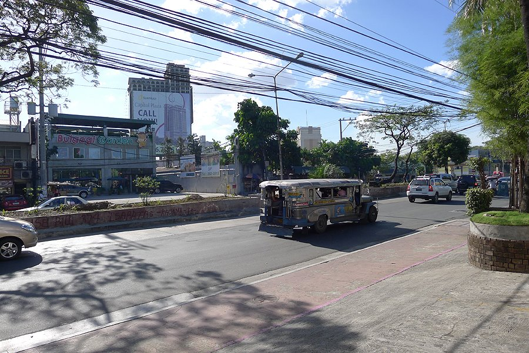
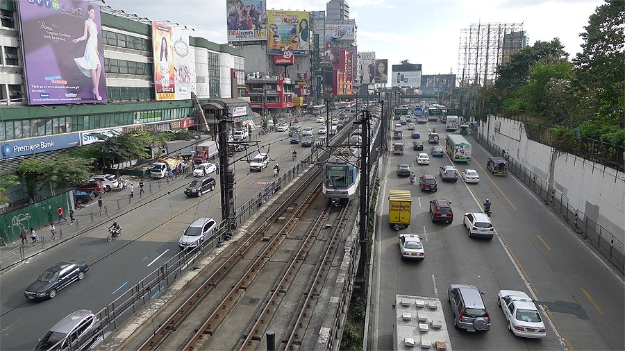

# By Accident, and Out of Necessity.

At first, I wasn't thinking about the Philippines at all. I had been preparing to enroll in a Japanese art graduate school (one of the top 3) and, after quite a long stretch of preparation, I applied and was waiting to hear back. But the day I received the news that I'd been accepted, that exact moment, was precisely one day before Japan was hit by three back-to-back disasters all at once: a `nuclear plant explosion`, a `tsunami`, and an `earthquake`.
 
The shock I felt back then is still vivid to me. I had sketched out a plan to enroll in graduate school right after college and build a career in applied arts, and it all came crashing down from the ground up. For two weeks I agonized over it, barely eating, and in the end I decided to cancel (though they did refund about 80%, not the full admission/tuition fee). After that I needed to redesign my future. While doing so, what caught my eye was `English`, and as I weighed the cost-effectiveness (English-speaking countries were honestly expensive), the option that came within range given the money I had was the Philippines.
 
And so, under the pretext of "language study abroad," I crossed over to the Philippines. (Actually, before that, I had spent a year in the US earning money to go to grad school in Japan.)

###### Honestly, at first it was partly an escape, a way to heal an exhausted body and mind. But life lets you meet new opportunities in unexpected places.

# Living There, I Thought, "Huh, This Is Actually Nice??"

When I say it's nice, it isn't truly "nice" in the simple sense. It's a feeling and a thought that comes only after going through trial and error and gaining a firsthand grasp of Philippine society before reaching the point of thinking, "this is nice." There's a saying that just about everyone repeats when we go to the Philippines:
> If you don't go to the places you're told not to go, and you don't do the things you're told not to do, you can lead a comfortable life in the Philippines.

Don't go to the places you're told not to go. - The meaning of this is something those in the know understand: it's one of the countries with shaky public safety. Since the current president, Duterte, took power, it has shown some signs of calming down, but it's more or less the same. What "public safety is bad" means, and the scope of it, is that the moment I step outside my door I can be exposed to an environment of crimes large and small. (Gun ownership is legal, but only for those who are licensed... though there is even a black market for illegally modified guns.) So you need to know how the locals get around outside.

Don't do the things you're told not to do. - This one... I don't know about other countries, but it applies to some of the tourists visiting from Korea or some of the Korean expats living there. What I mean is,

* Don't walk down the street holding an expensive phone the way you would in Korea. (Sooner or later you'll definitely become a target for crime.)
* There are people who, despite being nobodies back in Korea, the moment they arrive in the Philippines reveal a tendency to look down on the locals and want to be treated like kings. You have to be careful about this. Especially when an argument breaks out: pulling someone aside to talk one-on-one is fine, but scolding them or shouting them down in front of others or in a public place, the way you might in Korea, can in the worst case get you stabbed or become the cause of a shooting incident. There are many factors, but Filipinos have very strong pride, and when, as they put it, their 'hiya' is wounded, things can turn scary, so be careful.
* The sooner you throw out or change the idea that the foreigner is the one calling the shots, the better off you'll be.
* There are various things, but talking about them is useless. You have to go through and experience them yourself.

 

#### Even So, the Philippines Is a Place Where People Live, and Marriage

Once I recognized that they were different from me, respected the other person, and kept a positive attitude in everything, I found myself wondering whether such simple, good-natured people could really exist. (The hot climate all year round probably plays a part in the easygoing national character too.)
And... I had thought, 'marriage just isn't in the cards for me,' but perhaps it was meant to be: I met a wonderful woman, got married, and now have three kids and am having a great time.
Also, from my personal point of view, one of the ways the Philippines is better than Korea (this is divided into before I went to the Philippines and after I lived there) is:

> Before I went to the Philippines, I had bad dandruff on my scalp and various minor skin troubles, so I went to the dermatologist as if it were my own bedroom and was constantly on skin medication. (At some point they started treating me well, calling me a VIP customer... =.=;;)
> But after about six months in the Philippines, the dandruff on my scalp went away and those various minor skin troubles cleared up completely.
> Right now I'm in Korea (I came back around April 2014), and it's no secret that the scalp dandruff and skin troubles have flared up again and are giving me a hard time =.=;;
> I can't act on it because I don't have the money and I only think about it, but every now and then the thought 'Back to the Philippines??' crosses my mind. (shudder)

Because of all this, with my wife being a foreigner and having lived there for a long time, it now feels like a second home to me.
Oh, and mangoes were so cheap that I 'really' miss them. With Philippine money equivalent to about 10,000 to 20,000 won, I could go to a traditional market and fill up a whole black plastic bag... but now that I'm in Korea, mangoes are just so expensive...
 

###### I came thinking I'd only stay a little while and leave, but when I first arrived I had no idea I'd end up spending a long time living in a foreign country that wasn't my own.
